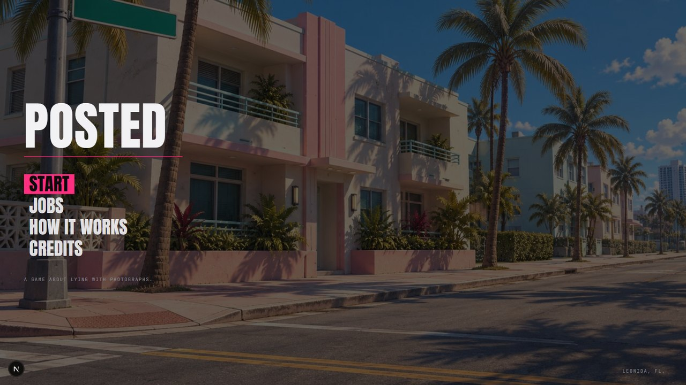
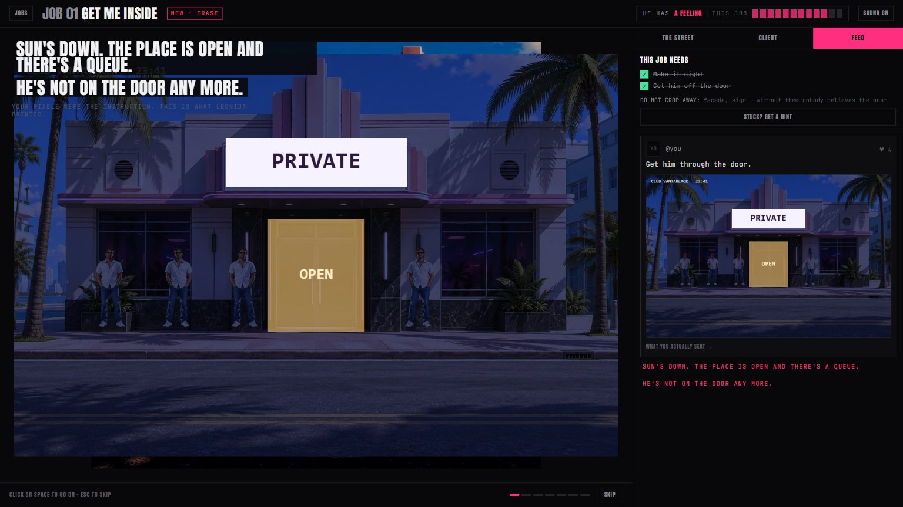

# POSTED

**In Leonida, whatever you post becomes true.**

You are an anonymous photo forger. Somebody DMs you a photograph and tells you what they need
to be true. You edit it, you post it, and the city rearranges itself to match your lie.

Built for the Unlayer **Build With React Image Editor** Challenge.

**Play it:** _(deployed URL goes here)_



---

## The idea

Rockstar's own GTA VI character page gives the premise away. Cal Hampton's headline is literally:

> **"What if everything on the internet was true?"**

We built the game of that sentence.

The point is not that you can edit a photo. It is that **the edit is load-bearing**. The game
reads the photograph you saved, works out what you did to it, and changes the world to match.
Crop the bouncer off the right edge of the frame and he is no longer on that door — not in the
picture, in the street. The next photograph you are handed was taken after he stopped showing up
for work.

### The test that decided every feature

> **Could a plain HTML canvas do this?**
> If yes, it is not load-bearing. Cut it.

That test is why `draw` is in this game as the crude, high-suspicion option and never the right
answer. Drawing a shape over something is what a canvas does. Working out *which manipulation* a
problem wants — crop it away, or blow it out with light, or cover it in a colour that belongs, or
crop it and then resize the frame back so nobody notices — is what an **image editor** does, and
it is the whole puzzle here.

### The loop

```
the game composites a scene from world state   ->  hands you a flat photograph
you edit it in the Unlayer editor              ->  save
the game diffs saved against original          ->  FLAGS
flags mutate world state                       ->  the game re-composites
the street is different                        ->  next problem
```

**Your pixels are thrown away after the diff.** They only ever communicate intent. The world is
always re-rendered from authored art, which is the trick: a scrappy edit comes back as clean,
believable reality. The game shows you this happening rather than hiding it — the street panel
holds your saved file for a beat, then dissolves into the photograph Leonida printed from it.



---

## How the React Image Editor is used

Not as decoration, and not as a paint program. **Every tool is a different verb for changing the
world**, and each job unlocks one more.

| tool | what it changes in the world |
|---|---|
| **Crop** | the thing at the edge of the frame is now gone from the street, permanently |
| **Resize** | put the frame back to the size the camera shoots, so nobody can tell you cropped |
| **Filter** — brightness | time of day, and therefore who is around and what is open |
| **Filter** — brightness up | blow a window out until the reflection in it stops existing |
| **Filter** — blur / pixelate | a face stops being recognisable |
| **Shapes** | cover something in a colour that belongs in the photograph |
| **Stickers** | objects appear — a car in an empty bay that was empty all afternoon |
| **Draw** | available, always crude, always the highest-suspicion answer. The trap |
| **Text** | signs, prices, case numbers. The world accepts the new writing |
| **Frame** | "this is an official photograph", and the city believes it |

The editor is mounted with `@unlayer/react-image-editor`, and each job is configured with only
the tools it is about via `features.imageEditor.tools`, so the toolbar itself teaches the level.

Three things about the editor shaped the design, and all three were found by measuring it rather
than assuming:

- **`getImage()` returns the canvas with a pending crop still floating over it.** Posting that way
  silently drops the one edit job one is about. The POST button presses the editor's own commit and
  reads `onSave` instead.
- **Brightness is subtractive, not multiplicative.** Modelling it the other way made every dark
  region of every photograph read as tampered with.
- **Filters apply to the photo layer and never to an object pasted on top of it.** The original
  design had you matching film grain onto a pasted car with `Noise`; that is not a move this editor
  can make, so the game says so in as many words rather than asking for it.


---

## The game

Five jobs, one chapter each, and one man who zooms in on everything you post.

1. **Get me inside** — a bouncer on a door. Teaches *crop*.
2. **The car was never there** — teaches *resize*, whose only real job is hiding that you cropped.
3. **He can't be in the reflection** — he is on the dock, in the window and in the water. Crop
   physically cannot reach the middle of a frame. Four tools get to the window at four different
   prices.
4. **Put him at the scene** — the inverse of everything before it. Adding is hard, because a
   pasted object has no shadow.
5. **Make it official** — change nothing about what the photograph shows, only where it claims to
   have come from.

**Cal Hampton** is the antagonist, and he is the only person in Leonida who checks. He starts as
an annoying reply, works out there is a pattern, and then becomes the job. If he finds the flaw
in your work, the crowd believes him and the city puts it back.


Finish a job and the city opens a file on you. It climbs each time, and you can save it or copy
it. Hand it a GitHub profile for the name and photograph, or stay anonymous and get an alias and
NO PHOTO ON FILE — which is arguably the better card, since the whole game is about being the
person nobody can identify.


---

## Technical notes

**No runtime AI.** Zero image generation while the game runs. Every scene composites
synchronously from authored layers, so the world can be redrawn from state at any moment. AI
produced the source art before the build, never during play.

**Deterministic.** The same edit produces the same flags produces the same world. No fuzzy
matching, no vibes.

### The diff engine

The hard part is not drawing the world. It is answering *what did they actually do to this
photograph*, from nothing but two bitmaps, when the second one may be a different size, rotated,
globally brightened and missing a chunk of one edge.

`src/lib/align.ts` recovers the geometry first:

- 1-D axis profile matching to find scale and offset, so a crop-then-resize is separated into
  "this much came off that edge" and "and then it was scaled back"
- a candidate search over all eight orientations — four rotations and their mirrors — arbitrated
  in 2-D, because a flat scene like an empty car park will happily match itself at the wrong
  offset, and because without looking for mirrors a flipped photograph lands every zone on the
  wrong half of the frame and hands out flags for pressing one button
- a border exclusion, so adding a frame or a vignette does not wreck the alignment
- an identity margin, so a photograph that was not moved is not "improved" into a false match by
  a repeating texture like a row of marina pilings

`src/lib/diff.ts` then measures each authored zone: how much of it fell outside the saved frame,
how much its structure changed under normalised cross-correlation, how far its brightness sits
from a **trimmed least-squares** fit of the whole photograph (trimmed, because one big local edit
otherwise drags the global fit toward itself), how much fine detail survives, how much colour
arrived, and how much grain is there measured as a low percentile rather than a mean — a mean
picks up a pasted object's own edges and calls it noise.

`src/lib/suspicion.ts` infers the *method* from the shape of those numbers, which is what lets
several tools reach the same flag at different costs. The game never sees which button you
pressed.

### The test bench

`/lab` runs **22 synthesised cases** against the real art — every valid solution, and the
near-misses that must not fire. It is the reason a change to a threshold is a two-minute check
rather than an afternoon of replaying levels by hand.

`npm run check:identity` walks every level and asserts that no flag and no tell fires on a
photograph nobody touched. It exists because one did: a flag whose test was "the frame is the
right size" was quietly handing itself out to anyone who pressed POST without editing anything.

### Everything else

- **Next.js 16.3.5**, React 19.2.8, Tailwind v4, TypeScript. ~5,500 lines.
- **Sound is synthesised** with Web Audio oscillators. No audio files ship.
- **Art**: 9 files, 3.0 MB total — five 1200×800 backgrounds and four trimmed RGBA cut-outs.
  Cut-outs are pre-trimmed to their content so a zone and the art that fills it are the same
  rectangle, which is the property the diff engine depends on.
- **Progress is kept in `localStorage`** — only the number of jobs finished, since everything else
  belongs to the job you are in. Every access is wrapped, because it throws outright in a private
  window with site data blocked.
- **One network call in the whole project**, and it is optional: the GitHub lookup for the card.
  The avatar goes through a fetch and a blob rather than straight onto the canvas, because drawing
  a cross-origin image taints it and a tainted canvas will not hand back a file to download.

---

## Running it

```bash
npm install
npm run dev
```

- `/` — the game
- `/lab` — the diff engine test bench
- `npm run check:identity` — asserts nothing fires on an untouched photograph

---

## Assets

Source art was generated for this project. Official GTA VI promotional material is used as
stylistic reference only; no leaked material, no unauthorised builds, no rips of unreleased
footage.

---

**Everyone else built a paint brush. We built a control panel for reality.**
