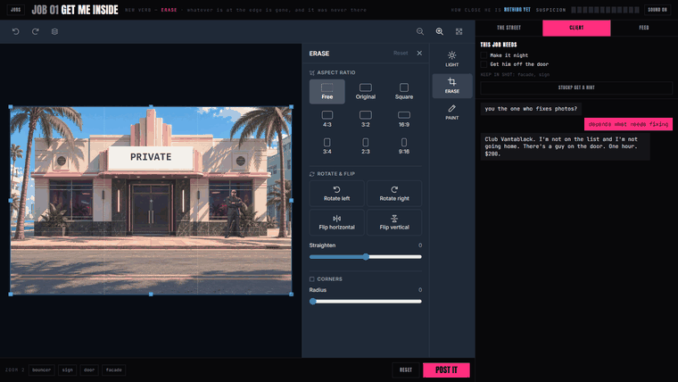
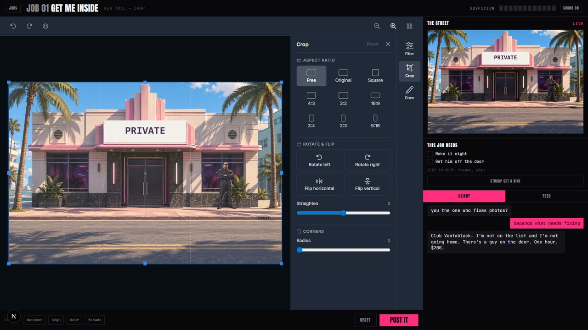
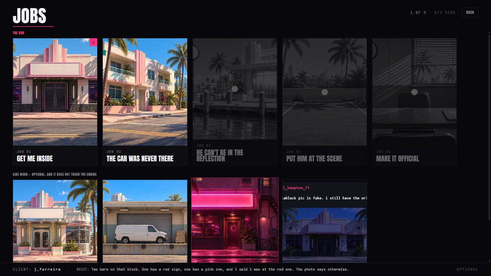
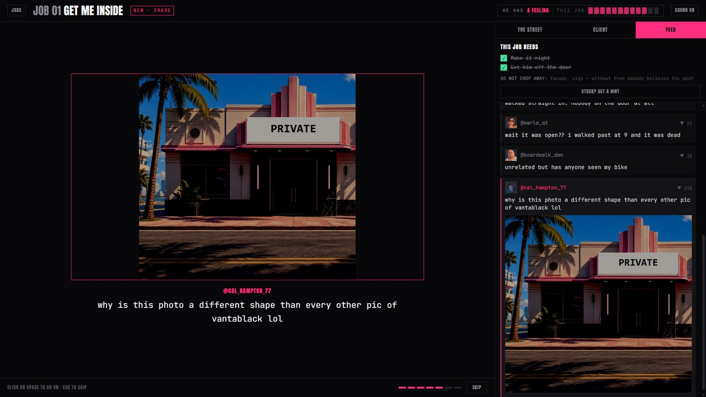
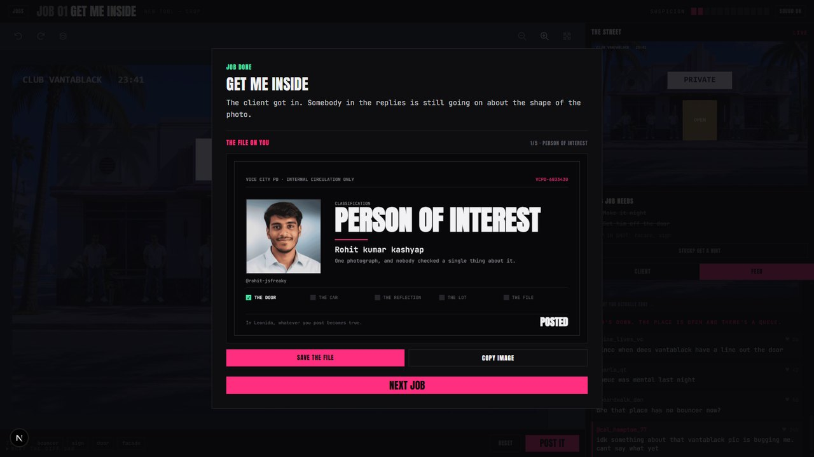

# POSTED

**In Leonida, whatever you post becomes true.**

You edit a photograph. The game reads what you did to it, **throws your pixels away**, and
rebuilds the city from clean authored art to match your lie. Crop the man off the edge of the
frame and he is no longer on that door — not in the picture, in the street. The next photograph
you are handed was taken after he stopped showing up for work.

Built for the Unlayer **Build With React Image Editor** Challenge.

**▶ Play it: [posted-omega.vercel.app](https://posted-omega.vercel.app/)**



*Drag the crop frame in past the man on the door. Take the light out of it. Press POST IT. The
street comes back at night, with a queue outside and nobody on that door — and none of those
pixels are yours. Everything below is that one idea, seven more times.*

---

## Challenge requirements

| | requirement | where |
|---|---|---|
| ✅ | React Image Editor is a **core interactive part**, not decoration | It is the only way to play. Every puzzle is solved inside it — see [How the editor is used](#how-the-react-image-editor-is-used) |
| ✅ | User can edit/customise at least one visual with it | Eight jobs, each one a different photograph edited in the editor |
| ✅ | Public GitHub repo with complete source | This repository |
| ✅ | Clear README: what it is · the idea · **how the editor is used** · screenshots · technical notes | This file |
| ✅ | Deployed, publicly accessible live URL | [posted-omega.vercel.app](https://posted-omega.vercel.app/) |
| ✅ | GTA VI-inspired concept | Leonida. The premise is Cal Hampton's own headline from Rockstar's character page |
| ✅ | No Rockstar assets | All art generated for this project. Official material used as stylistic reference only |

**Needs a laptop.** The whole game is a photo editor you drag handles around in; on a phone there
is nowhere to put it, and the game says so rather than breaking.

---

## The idea

Rockstar's own GTA VI character page gives the premise away. Cal Hampton's headline is literally:

> **"What if everything on the internet was true?"**

We built the game of that sentence.

The point is not that you can edit a photo. It is that **the edit is load-bearing**. Nothing you
draw is ever shown back to you as the world — your saved file is read once, for what it means,
and then discarded. What comes back is the city, re-composited from authored layers to agree with
you. That gap, between a scrappy edit going in and clean believable reality coming out, is the
whole game.

### The test that decided every feature

> **Could a plain HTML canvas do this?**
> If yes, it is not load-bearing. Cut it.

That test is why `draw` is in this game as the crude, high-suspicion option and never the right
answer. Drawing a shape over something is what a canvas does. Working out *which manipulation* a
problem wants — crop it away, or blow it out with light, or cover it in a colour that belongs, or
crop it and then resize the frame back so nobody notices — is what an **image editor** does, and
it is the whole puzzle here.

### The loop

```
the game composites a scene from world state   ->  hands you a flat photograph
you edit it in the Unlayer editor              ->  save
the game diffs saved against original          ->  FLAGS
flags mutate world state                       ->  the game re-composites
the street is different                        ->  next problem
```

---

## How the React Image Editor is used

**The editor is the control panel, and it says so.** The library lets a host app rename every
control it renders and hand it a different icon, so the tool rail is not Crop/Resize/Filter — it
is what those things *do to Leonida*. Same editor, same tools, our words:

| the editor now says | tool | the job it answers | what the engine measures |
|---|---|---|---|
| **ERASE** | crop | a doorman standing at the edge of the frame | how much of his zone fell outside the saved frame |
| **COVER UP** | resize | he checks dimensions now, so put the frame back | saved width × height against what you were handed |
| **LIGHT** | filter | the hour, the weather, and how old the photograph is | a trimmed least-squares fit of the whole image |
| **PAINT** | draw | always available, always crude, always the trap | hard edges that match nothing around them |
| **REWRITE** | text | a case number on an evidence label | that the label region changed, then it asks you what you wrote |
| **BOARD UP** | shapes | cover a face in a colour that belongs | detail collapsing, or a third of the zone replaced |
| **PLANT** | stickers | a car in a bay that was empty all afternoon | new content in a flat region, and whether it throws a shadow |
| **OFFICIAL** | frame | this came from a police archive, not a phone | the outer 4% ring changing on three sides or more |

The editor's own commit button reads **POST IT**, because that is what pressing it does. Its
`Noise` slider reads **GRAIN**. All eight icons are ours. This is `options.translations` and a
per-tool `icon`, applied through `updateOptions` so nothing remounts.

Each job is configured with only the tools it is about, so the rail itself teaches the level — by
job five it has filled up, and a legend in the side panel says what each verb does to the city.

### What the editor taught us, measured rather than assumed

Everything below was found by driving the real editor in a browser, not by reading docs:

- **`getImage()` returns the canvas with a pending crop still floating over it.** Posting that way
  silently drops the one edit job one is about. POST IT presses the editor's own commit and reads
  `onSave`.
- **Brightness is subtractive, not multiplicative.** Modelling it the other way made every dark
  region of every photograph read as tampered with.
- **Filters reach the photo layer and never an object pasted on top of it.** At Noise 35 the whole
  car park grained to 0.33 and a pasted car stayed at 0.003. So the game never asks you to grain a
  paste — it gives `Noise` the job it can actually do, ageing the photograph itself.
- **A filter stays a live preview until its panel is closed**, so it is not in `getImage()` yet.
- **Save returns JPEG even when fed a PNG**, so every threshold has to survive compression noise.
- **The tool rail is 72px wide at 10px type** — about 30px of usable label. `ERASE` came back as
  `ERAS…` until the column was widened.
- **The editor writes its own stylesheet at runtime, after yours**, with rules that score exactly
  what yours do. On a tie the later sheet wins, so overriding it needs one more class.

**Rotate, Straighten and corner radius have no job in this game, and that is deliberate.** Each is
one click with one answer — there is no puzzle in "which way up is this". Inventing a level for
them would have been coverage for its own sake.



---

## The game

Eight jobs: a run of five with a story, and three optional side jobs that do not touch the ending.

1. **Get me inside** — a bouncer on a door. Teaches *crop*.
2. **The car was never there** — teaches *resize*, whose only real job is hiding that you cropped.
3. **He can't be in the reflection** — he is on the dock, in the window and in the water. Crop
   physically cannot reach the middle of a frame. Four tools get to the window at four prices.
4. **Put him at the scene** — the inverse of everything before it. Adding is hard, because a
   pasted object has no shadow.
5. **Make it official** — change nothing about what the photograph shows, only where it claims to
   have come from.

The **side work** covers the parts of the editor the run never needs: filter presets and grain
(*This is from years ago*), contrast, sharpen and the 4:3 preset (*Off the gantry camera*), and
hue (*The sign was red* — the only job whose answer is a slider that turns every colour at once,
on the only photograph where that is honest, because it is a street lit by one neon sign).



### Posting is the whole event

Press POST IT and the workspace is taken over. The file you sent fills the screen; the photograph
Leonida printed from it develops down over the top; what the street did stamps in a line at a
time; the crowd arrives. If **Cal Hampton** has found your flaw, the stage pushes into the exact
place he is pointing at, his line types out, and the city un-prints your work while the crowd
agrees with him. Click or space to go on, Escape to skip — and skipping can never land the world
somewhere watching it would not have, because the whole sequence is computed before a frame of it
plays.



He is the only person in Leonida who checks anything, and **he keeps the originals**. His posts
survive the job they happened in, so by job three "same hand on all three" comes with the three
photographs attached.

### What it costs you

Suspicion adds up — across a job, so splitting work over three careful little posts is not
cheaper than one honest one, and across the run. The header says how close he is in three words;
the file the city keeps on you gets stamped CLEAN, MARKED or BURNED; and the last line of the
ending is about whether he ever got close enough to name you.

Finish a job and the city opens that file. It climbs with the run, and there is one classification
above the top of the ladder that only somebody who also took every job on the side ever sees. Hand
it a GitHub profile for the name and photograph, or stay anonymous and get an alias and NO PHOTO
ON FILE — arguably the better card, since the game is about being the person nobody can identify.



---

## Technical notes

**No runtime AI.** Zero image generation while the game runs. Every scene composites
synchronously from authored layers, so the world can be redrawn from state at any moment. AI
produced the source art before the build, never during play.

**Deterministic.** The same edit produces the same flags produces the same world. No fuzzy
matching, no vibes.

### The diff engine

The hard part is not drawing the world. It is answering *what did they actually do to this
photograph*, from nothing but two bitmaps, when the second one may be a different size, rotated,
globally brightened and missing a chunk of one edge.

`src/lib/align.ts` recovers the geometry first:

- 1-D axis profile matching to find scale and offset, so a crop-then-resize is separated into
  "this much came off that edge" and "and then it was scaled back"
- a candidate search over all eight orientations — four rotations and their mirrors — arbitrated
  in 2-D, because a flat scene like an empty car park will happily match itself at the wrong
  offset, and because without looking for mirrors a flipped photograph lands every zone on the
  wrong half of the frame and hands out flags for pressing one button
- a border exclusion, so adding a frame or a vignette does not wreck the alignment
- an identity margin, so a photograph that was not moved is not "improved" into a false match by
  a repeating texture like a row of marina pilings

`src/lib/diff.ts` then measures each authored zone: how much of it fell outside the saved frame,
how much its structure changed under normalised cross-correlation, how far its brightness sits
from a **trimmed least-squares** fit of the whole photograph (trimmed, because one big local edit
otherwise drags the global fit toward itself), how much fine detail survives, how much colour
arrived, and how much grain is there measured as a low percentile rather than a mean — a mean
picks up a pasted object's own edges and calls it noise. The same high-frequency distribution
read from its *top* instead of its floor gives edge hardness, which is what sharpening moves and
what a standard deviation does not, normalised by the photometric gain so pushing contrast cannot
fake it. Hue is a circular mean weighted by saturation, because grey pixels have no hue and 350°
to 10° is a turn of twenty rather than minus three hundred and forty.

`src/lib/suspicion.ts` infers the *method* from the shape of those numbers, which is what lets
several tools reach the same flag at different costs. **The game never sees which button you
pressed** — blur the photograph in another program entirely and it scores the same.

Open **Forensics** in the bottom-left of any job to see exactly what it read off your last post.

### How it is checked

| | what it proves |
|---|---|
| `/lab` | **39 synthesised edits** against the real art — every valid solution and the near-misses that must not fire |
| `npm run check:identity` | no flag and no tell fires on a photograph nobody touched. It exists because one did |
| `npm run check:content` | no line is said twice, every fatal tell says what to do instead, every tool has a verb, every translation key still exists in the library's types |
| `npm run check:sequence` | **96 outcomes** — every level against every way a post can go, including all fifteen fatal tells — produce a sequence that opens on the photograph, holds every beat, and ends where it says it does |
| `npm run play` | drives the **real editor in a real browser** with a real mouse: crop, resize, every filter slider, the aspect presets and the brush, across six of the eight jobs |

### Everything else

- **Next.js 16.3.5**, React 19.2.8, Tailwind v4, TypeScript. ~9,700 lines across `src/` and `tools/`.
- **Sound is synthesised** with Web Audio — cues plus a per-scene bed of filtered noise and one low
  tone. No audio files ship, nothing to license.
- **Art**: 13 files, 4.0 MB total — eight 1200×800 backgrounds and five trimmed RGBA cut-outs.
  Cut-outs are pre-trimmed to their content so a zone and the art that fills it are the same
  rectangle, which is the property the diff engine depends on.
- **The title screen plays the first job on a loop** before you touch anything, composited from the
  same art the game uses, so it cannot drift from what you are about to do.
- **Progress is in `localStorage`** — jobs finished, suspicion carried, and his thread. Every access
  is wrapped, because it throws outright in a private window with site data blocked.
- **One network call in the whole project**, and it is optional: the GitHub lookup for the card.
  The avatar goes through a fetch and a blob rather than straight onto the canvas, because drawing
  a cross-origin image taints it and a tainted canvas will not hand back a file to download.

---

## Running it

```bash
npm install
npm run dev
```

- `/` — the game
- `/lab` — the diff engine test bench
- `npm run check:identity` · `check:content` · `check:sequence` — the three checks that need no browser
- `npm run play` — plays it in a real browser (needs `npm run dev` running)

---

## Assets

Source art was generated for this project. Official GTA VI promotional material is used as
stylistic reference only; no leaked material, no unauthorised builds, no rips of unreleased
footage.

---

**Everyone else built a paint brush. We built a control panel for reality.**
